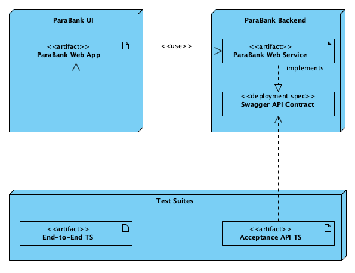
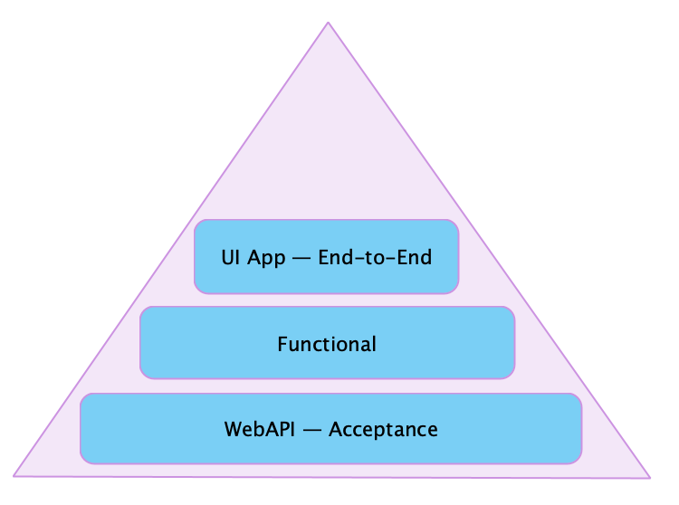

# 1. Testing Strategy

## Status
Accepted

## Context
The QA team must formulate a centralised testing strategy to define the testing activities and quality gateways for the 
software development life-cycle.

## Decision
Due to the nature of the system under test (SuT) (ParaBank is a web application), the testing method is black-box 
testing with focus on business-aspects of the application.

After considering the ParaBank web application deployment diagram:

we can distinguish two testing angles:
1. testing of the [web-service API](./2_web_service_api_testing_strategy.md)
2. testing of the [UI application](./3_web_application_testing_strategy.md).

#### Testing Pyramid

So the testing pyramid for the ParaBank project takes a look:

Testing levels:
| Level                       | Test suite        | Description                                                  |
| --------------------------- | ----------------- | ------------------------------------------------------------ |
| Acceptance tests            | WebAPI TS         | the foundational stone of the application and must be validated first |
| <del>Functional tests</del> | ignored for now   | would test distinct automic functions provided by the application |
| End-to-End tests            | UI application TS | test the user intents from the system                        |

## Potential extensions
The current testing strategy doesn't focus on the non-functional aspects of the application. This is a task for an upcoming iteration:
* Performance testing.
* Security testing.
* Reliability testing.

## Consequences
TBD after implementation and probation.