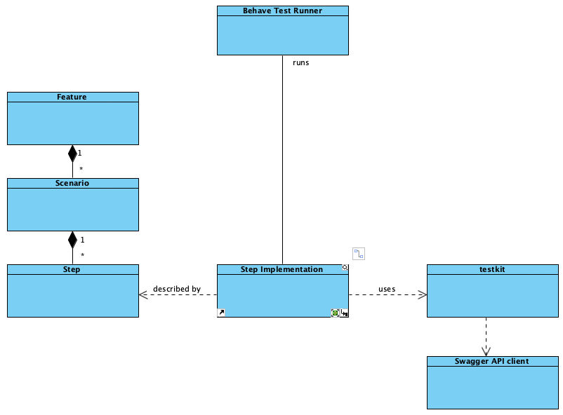

# 2. Web-Service API testing

## Status

Formulated, Partially implemented

## Context

The Web-Service API testing suite is implemented as an acceptance test one, meaning that all the endpoints actions are to be covered with expected behaviour, capturing all-business relevant activities and expectations.

## Decision

The test suite is implemented as a BDD-test suite capturing all the expected behaviour from the Web-Service API.

So the minimal PoC suite is implemented covering some cases. And the rest is covered in the Web Application test suite.

#### Tech stack

* Python
* Behave
* Swagger OpenAPI client

#### Features grouping

The features are to be grouped using tags for further regression testing.

## Consequences

TBD after implementation and probation.