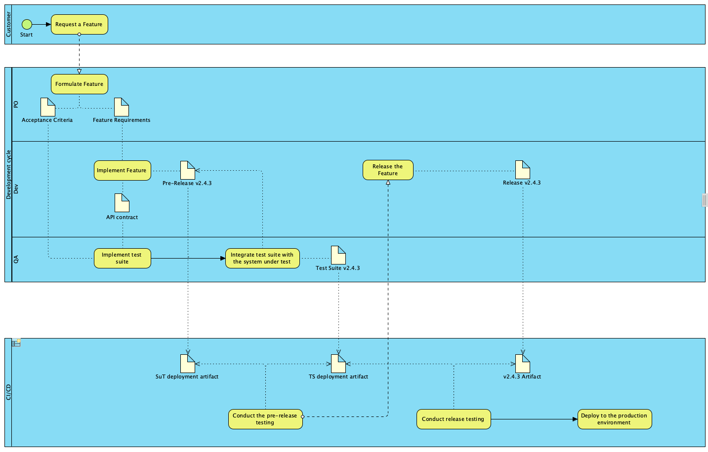

# 4. CI/CD

## Status

Hypothesized

## Context

The automated test suites must be integrated into the CI/CD pipeline.

## Proposal

### Containerisation
The test suites should be containerised into a docker image. All available test cases are deployed inside one such docker container. Each test suite has its dedicated containerisation pipeline. The docker command passed to the starting container determines the list of the executed test cases. The cases clustering mechanisms are
* tags
* feature file names

The test-suite clustering is based on the requirements traceability mechanism used in the development life-cycle.

## Development life-cycle option
